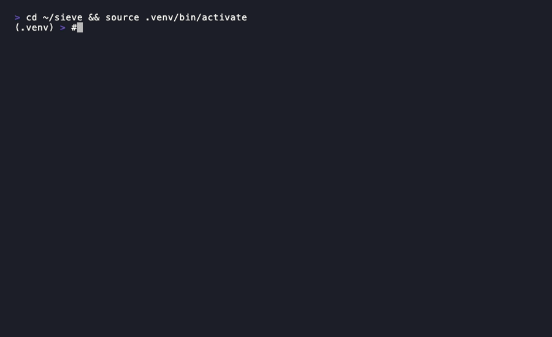

# sieve

> Your model is only as good as the data you trained it on. Most teams never close that loop.

[](LICENSE)
[](https://www.python.org)
[]()

---

Frontier labs (Anthropic, OpenAI, Google) continuously improve their models by mining production interactions for training signal. They call it a **data flywheel**. Every real user query that gets a great response becomes training data for the next version.

Your team doesn't have that. You fine-tune once, ship, and hope.

**sieve** is the missing piece: a CLI pipeline that turns your production LLM logs into a versioned, high-quality training dataset — and hands it off to Axolotl or LLaMA-Factory to retrain.

```
production logs ──► score ──► filter ──► versioned dataset ──► fine-tune
```

No API keys. No SaaS. Runs entirely on your machine.



---

## The problem it solves

You've fine-tuned a Llama model on your support chat data. It works well. Three months later, your product has changed, your users are asking different questions, and the model is drifting. You know the answers to those new questions exist somewhere in your logs.

But finding them means:

1. Manually exporting thousands of log rows
2. Reading through them to find the good ones
3. Formatting them for your training framework
4. Remembering which examples you already used last time

**sieve automates all of that.**

---

## Quickstart

```bash
git clone https://github.com/nidhisebastian008/sieve
cd sieve
python3 -m venv .venv && source .venv/bin/activate
pip install -e .
```

```bash
# ingest your logs (supports OpenAI, prompt/response, and conversations formats)
sieve ingest production_logs.jsonl

# score every interaction — no API key needed
sieve score

# see what you've got
sieve stats
```

```
     Sieve Pipeline Stats
┏━━━━━━━━━━━━━━━━━━━━┳━━━━━━━┓
┃ Metric             ┃ Value ┃
┡━━━━━━━━━━━━━━━━━━━━╇━━━━━━━┩
│ Total interactions │ 8420  │
│ Scored             │ 8420  │
│ Avg quality score  │ 0.614 │
│ Dataset versions   │ 1     │
│ Training runs      │ 0     │
└────────────────────┴───────┘
```

```bash
# curate only the good stuff
sieve dataset create v1.0 --min-quality 0.7

# export for fine-tuning
sieve dataset export v1.0 --output train.jsonl

# generate training config + command
sieve train v1.0 --export-path train.jsonl --base-model meta-llama/Llama-3.2-3B-Instruct
```

```
✓ Training run recorded (id: 32bd15fb)

Run training with Axolotl:
  pip install axolotl
  axolotl train axolotl_config.yml
```

---

## Dataset versioning

The flywheel only works if you track what you've already trained on. sieve versions every dataset and supports incremental builds — next month's run only includes new interactions.

```bash
# next month: only new interactions not in v1.0
sieve dataset create v2.0 --min-quality 0.7 --diff v1.0

sieve dataset list
```

```
┏━━━━━━┳━━━━━━━━━━━━━━┳━━━━━━━━━━━━━┳━━━━━━━━┳━━━━━━━━━━━━━━━━━━┓
┃ Name ┃ Interactions ┃ Min Quality ┃ Parent ┃ Created          ┃
┡━━━━━━╇━━━━━━━━━━━━━━╇━━━━━━━━━━━━━╇━━━━━━━━╇━━━━━━━━━━━━━━━━━━┩
│ v1.0 │ 3102         │ 0.70        │ —      │ 2026-06-30 10:00 │
│ v2.0 │ 891          │ 0.70        │ v1.0   │ 2026-07-30 09:00 │
└──────┴──────────────┴─────────────┴────────┴──────────────────┘
```

Lineage is tracked in a local SQLite database at `~/.sieve/sieve.db`. You own your data.

---

## Input formats

sieve normalises all common LLM log formats automatically:

```jsonl
{"messages": [{"role": "user", "content": "..."}, {"role": "assistant", "content": "..."}]}
{"prompt": "...", "response": "..."}
{"conversations": [{"role": "user", "content": "..."}, {"role": "assistant", "content": "..."}]}
```

---

## Scorers

| Scorer | Needs | What it checks |
|---|---|---|
| **Heuristic** (default) | Nothing | Response length, refusal patterns, empty messages |
| **LLM-as-judge** (coming) | Ollama or API key | Helpfulness, factuality, relevance via model grading |

---

## Architecture

sieve is built around pluggable interfaces. Swap out any stage.

```
sieve/
├── ingest/      ← BaseIngester  (JSONL ✓ · Langfuse coming · OpenTelemetry coming)
├── score/       ← BaseScorer   (Heuristic ✓ · LLM judge coming)
├── curate/      ← versioning, lineage, diff, export
└── trigger/     ← Axolotl ✓ · LLaMA-Factory coming · Modal coming
```

Implement `BaseIngester` or `BaseScorer`, drop it in — no core changes needed.

---

## Who this is for

- Teams fine-tuning **open models** (Llama, Mistral, Qwen) on their own infrastructure
- Companies with **data privacy requirements** that can't send logs to a third-party platform
- Anyone doing **continuous fine-tuning** who is currently managing training data in spreadsheets

If you're using OpenAI or Anthropic APIs and never touching open models, sieve is not for you — yet.

---

## Roadmap

- [ ] Langfuse ingester — pull traces directly without manual export
- [ ] OpenTelemetry ingester
- [ ] LLM-as-judge scorer (Ollama + Anthropic/OpenAI)
- [ ] LLaMA-Factory trigger
- [ ] Modal cloud GPU trigger
- [ ] HuggingFace dataset push
- [ ] `sieve eval` — score base model vs fine-tuned on held-out examples

---

## Contributing

PRs welcome. The most impactful areas right now: new ingesters and new scorers.

```bash
pytest tests/ -v   # 12 tests, all passing
```

---

## License

Apache 2.0
